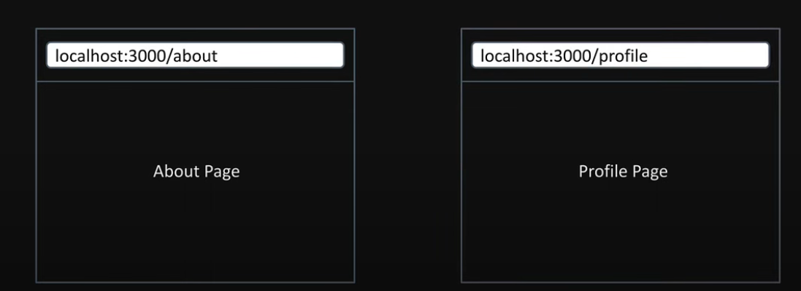

# Routing Conventions 

- All routes must be placed inside the `app` folder
- Every file that corresponds to a route must be named page.js or page.tsx
- Every folder corresponds to a path segment in the browser URL. 
 

## Scenario 2 

1. routes are associated with a file based on the containing folders name within app folder     
2. the about folder maps to `/about` while page.tsx within the profile folder maps to `/profile`
3. convention over configuration for routing. 